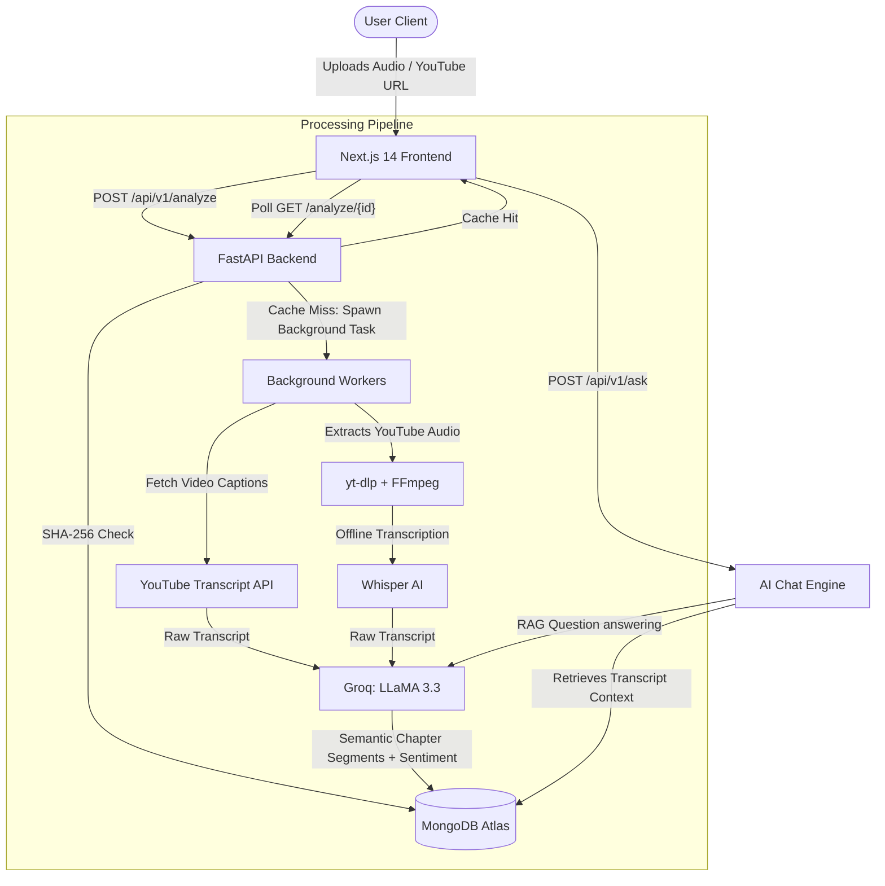

# 🎙️ Podcast Intelligence Platform v2

[](https://fastapi.tiangolo.com/)
[](https://nextjs.org/)
[](https://www.mongodb.com/)
[](https://www.docker.com/)
[](https://groq.com/)
[](https://github.com/openai/whisper)

An enterprise-grade, AI-powered podcast analysis platform built on a **decoupled monorepo** architecture. This platform allows users to upload local podcast audio files or directly import YouTube links to instantly extract semantic chapters, perform sentiment analysis, download MP3 conversions, and chat contextually with their podcasts.

---

## 🏗️ System Architecture



---

## ✨ Key Engineering Features & Highlights (What Recruiters Look For)

*   **Smart File Caching & Cost Optimization**: Computes a unique **SHA-256 hash** of every uploaded file. If the file has been analyzed before, it immediately returns the cached analysis, completely bypassing costly LLM and GPU transcription runs.
*   **Asynchronous Background Workflows**: Leverages FastAPI's `BackgroundTasks` to offload computation-heavy transcription (Whisper) and structuring (LLaMA 3.3) jobs, ensuring immediate HTTP responses and a responsive UI.
*   **Robust Multi-Modal Extraction**:
    *   Attempts rapid metadata extraction via `youtube_transcript_api`.
    *   Gracefully falls back to downloading audio using `yt-dlp` paired with an `FFmpeg` MP3 extraction pipeline if native YouTube transcripts are unavailable.
    *   Employs Whisper AI (`tiny` model optimized for CPU environments) to run offline transcription.
*   **Contextual RAG Chat Interface**: Enables users to query their podcast transcript in real time. The chat engine retrieves the full transcript context from MongoDB and prompts LLaMA 3.3 to answer with direct reference to the content.
*   **Production-Ready Containerization**: Fully dockerized backend utilizing multi-stage builds and a CPU-optimized PyTorch layer, keeping the build size minimal and preventing RAM exhaustion on hosting platforms (like Render/Railway).

---

## 📁 Project Structure

```
podcast-intelligence-v2/
├── README.md
├── backend/
│   ├── Dockerfile            # Container build (optimized for CPU PyTorch & FFmpeg)
│   ├── .dockerignore         # Excludes environments & cache folders
│   ├── requirements.txt      # Python backend dependencies
│   └── app/
│       ├── main.py           # FastAPI entrypoint + CORS + Lifespan DB bindings
│       ├── core/
│       │   ├── config.py     # Pydantic Settings env configuration loader
│       │   └── db.py         # Motor async MongoDB driver connection
│       ├── models/
│       │   ├── podcast.py    # Podcast schemas
│       │   └── conversation.py # Chat message & memory models
│       ├── services/
│       │   ├── transcription.py  # SHA-256 Hashing + Whisper Engine
│       │   └── intelligence.py   # LLaMA 3.3 Prompting Engine
│       └── api/v1/
│           ├── api.py             # Router aggregator
│           └── endpoints/
│               ├── analyze.py     # Upload and analysis routes
│               ├── ask.py         # Contextual chat engine
│               └── audio.py       # YouTube downloader with FFmpeg MP3 post-processor
└── frontend/
    ├── package.json          # Node dependencies & Next.js scripts
    └── src/app/
        ├── layout.tsx        # Styled wrapper (Google Fonts & Layouts)
        ├── page.tsx          # App dashboard & core logic controller
        ├── globals.css       # Custom design system (Glassmorphism & animations)
        └── components/
            ├── Dashboard.tsx     # File uploader & YouTube extractor UI
            ├── Analytics.tsx     # Timeline segments & sentiment analytics
            └── ChatInterface.tsx # Interactive chat module
```

---

## ⚡ Quick Start

### ⚙️ Prerequisites

- **Python**: `≥ 3.10`
- **Node.js**: `≥ 18.0`
- **MongoDB**: Local community edition or MongoDB Atlas cloud account
- **ffmpeg**: Required by Whisper and `yt-dlp` for media handling.
  - *Windows*: Run `winget install ffmpeg`
  - *macOS*: Run `brew install ffmpeg`
  - *Linux*: Run `sudo apt install ffmpeg`

---

### 1️⃣ Backend Setup

```bash
cd backend

# Create and activate virtual environment
python -m venv venv
# On Windows:
venv\Scripts\activate
# On macOS/Linux:
# source venv/bin/activate

# Install dependencies
pip install -r requirements.txt

# Configure environment variables
cp .env.example .env
# Open .env and fill in your MONGO_URI and GROQ_API_KEY

# Start the development server
python -m uvicorn app.main:app --reload
```
* The API will be available at: **http://localhost:8000**
* Interactive Swagger Docs: **http://localhost:8000/docs**

---

### 2️⃣ Frontend Setup

```bash
cd frontend

# Install dependencies
npm install

# Configure environment variables
cp .env.example .env.local
# Set NEXT_PUBLIC_API_URL to http://localhost:8000

# Start development server
npm run dev
```
* Next.js will be running at: **http://localhost:3000**

---

## 🔑 Environment Variables Reference

#### Backend (`backend/.env`)
| Variable | Description | Default / Example |
|---|---|---|
| `MONGO_URI` | MongoDB Connection String | `mongodb://localhost:27017/` |
| `DB_NAME` | Database identifier | `podcast_intelligence_v2` |
| `GROQ_API_KEY` | Groq Developer Key | `gsk_...` |
| `HOST` | Bind host IP | `0.0.0.0` |
| `PORT` | FastAPI listener port | `8000` |

#### Frontend (`frontend/.env.local`)
| Variable | Description | Default / Example |
|---|---|---|
| `NEXT_PUBLIC_API_URL` | Deployed backend server API root | `http://localhost:8000` |

---

## 🛸 Key API Design

| Method | Endpoint | Description |
|---|---|---|
| `POST` | `/api/v1/analyze` | Initiates analysis of an uploaded audio file. Checks Cache first. |
| `POST` | `/api/v1/analyze/local/{video_id}` | Triggers Whisper / LLM processing on cached local MP3. |
| `POST` | `/api/v1/audio/extract-youtube` | Uses `yt-dlp` + `ffmpeg` to cache a YouTube stream as an MP3. |
| `GET` | `/api/v1/audio/download-local/{video_id}` | Streams the converted MP3 file to the client for local download. |
| `GET` | `/api/v1/analyze/{id}` | Polls progress status (`processing`, `completed`, `failed`). |
| `POST` | `/api/v1/ask` | Chat context handler (retrieves transcript segments dynamically). |

---

## 🚀 Deployment Instructions

### Docker Production Build (Backend)
The backend includes a pre-configured Docker environment optimized for headless deployment:
```bash
# Build the container locally
docker build -t podcast-backend backend/

# Run the container
docker run -p 8000:8000 --env-file backend/.env podcast-backend
```
*Compatible with instant deployment platforms like **Render**, **Railway**, and **Hugging Face Spaces**.*

### Frontend Production Build
To prepare the Next.js production build:
```bash
LIVE : https://podcast-intelligence-tau.vercel.app/
